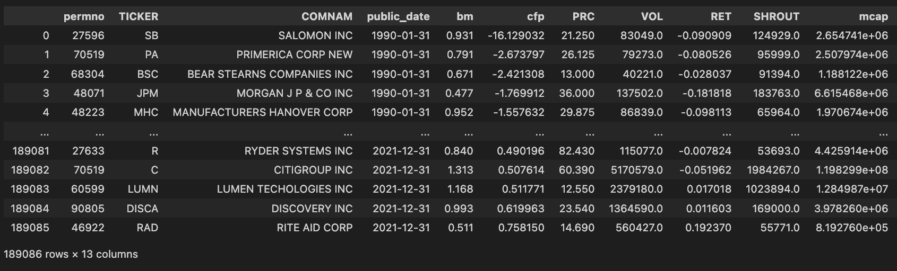
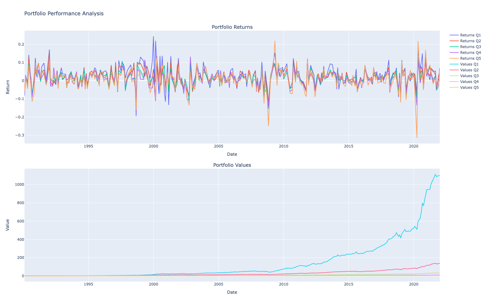

# Final Project - Cash flow to price ratio
Gabriel de La Noue

# Approach 
The goal of this study is to highlight the fact that stocks with high CF/P ratios may be undervalued due to irrational investor behavior (e.g., overconfidence or anchoring biases).

# Data collection
The dataset used was queried using CRSP and WRDS.
It contains monthly financial data of all the companies of the S&P 500 from 1990 to the end of 2021.

To create the dataset, PERMNO codes were obtained using the "permno_code_sp500.ipynb" notebook. The code connects to WRDS's servers to query data. Next, the financial ratios and stocks prices on the CRSP platform and aggregated.

The final dataset contains, among others, the cash flow to price ratio (`cfp`), the stock price (`PRC`) and market cap (`mcap`) for each company of the S&P 500 for each month (see image).

# Methodology
- Every month, companies are sorted by CF/P ratio and put into 5 groups of equal size (5 quantiles).
- Portfolios are formed based on the quantile groupings (e.g., Q1, Q2, ..., Q5).
- The 5 portfolios returns are computed by weighting stocks by their market capitalization in the portfolio, held for 1 months and rebalanced every month.

# Results

The returns are plottend on the top graph and the portfolio values on the bottom ones. 

The Q1 portfolio corresponds to the one with the lowest Cash Flow to Price ratio. We see that companies with high CF/P ratio are a lot less attractive to investors even thought it generally indicates a substantial amount of cash generated relative to its market price.

