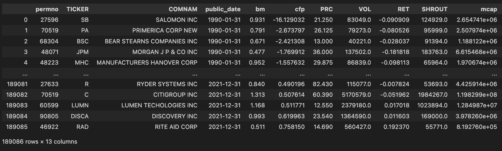
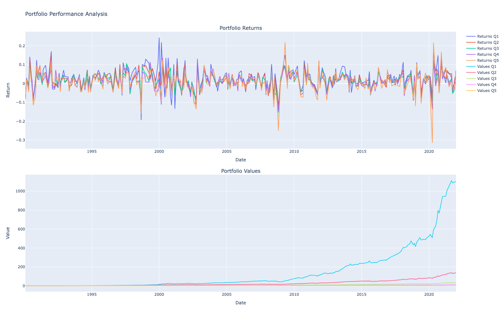

# Final Project - Cash Flow to Price Ratio
Gabriel de La Noue

## Approach
The goal of this study is to highlight the fact that stocks with high CF/P ratios may be undervalued due to irrational investor behavior (e.g., overconfidence or anchoring biases).

## Data Collection
The dataset used was queried using CRSP and WRDS.
It contains monthly financial data of all the companies in the S&P 500 from 1990 to the end of 2021.

To create the dataset, PERMNO codes were obtained using the "permno_code_sp500.ipynb" notebook. The code connects to WRDS's servers to query data. Next, the financial ratios and stock prices on the CRSP platform were aggregated.

The final dataset contains, among others, the cash flow to price ratio (`cfp`), the stock price (`PRC`), stock return (`RET`), and market cap (`mcap`) for each company in the S&P 500 for each month (see image).

## Methodology  
- Every month, companies are sorted by CF/P ratio and placed into 5 groups of equal size (5 quantiles).
- Portfolios are formed based on the quantile groupings (e.g., Q1, Q2, ..., Q5).
- The 5 portfolio returns are computed by weighting stocks by their market capitalization in the portfolio, held for 1 month, and rebalanced every month.

This method is implemented in the "project.ipynb" python notebook.

## Results - The Impact of Cash Flow to Price Ratios on S&P 500 Company Performance: A Behavioral Finance Perspective
The returns are plotted on the top graph, and the portfolio values on the bottom ones.

In analyzing the S&P 500, a compelling trend emerges: companies with low cash flow-to-price (CF/P) ratios tend to underperform significantly compared to those with high CF/P ratios. This finding aligns with behavioral finance theories, suggesting that market participants may systematically undervalue or overvalue firms based on psychological biases and imperfect information processing.

### Key Observations:

1. High CF/P Ratios Correlate with Stronger Performance: Companies with high CF/P ratios are often perceived as undervalued by the market. They may reflect strong operational efficiency and consistent cash generation relative to their price.

2. Low CF/P Ratios Linked to Poorer Performance: Low CF/P ratios suggest weaker cash generation relative to market valuation. Companies are often overvalued due to hype, sentiment, or speculative narratives rather than fundamentals.

### Potential Behavioral Explanations:

1. Overconfidence and Representativeness Bias: Investors may be overly optimistic about companies with strong growth narratives or recent momentum, ignoring weak underlying cash flows. Conversely, firms with robust cash flows may be overlooked if they lack a compelling growth story.

2. Anchoring on Earnings: Traditional focus on metrics like P/E ratios may cause investors to underweight cash flow—a more direct indicator of financial health.

3. Herding Behavior: Investors may chase popular stocks, further inflating valuations of low CF/P companies while neglecting fundamentally sound high CF/P stocks.

4. Loss Aversion: Investors may avoid companies with high CF/P ratios due to perceived risks (e.g., cyclical industries or lack of growth catalysts), despite their attractive valuations.

Finally, this analysis underscores the importance of integrating behavioral finance insights into investment strategies, particularly when examining valuation metrics within major indices like the S&P 500.